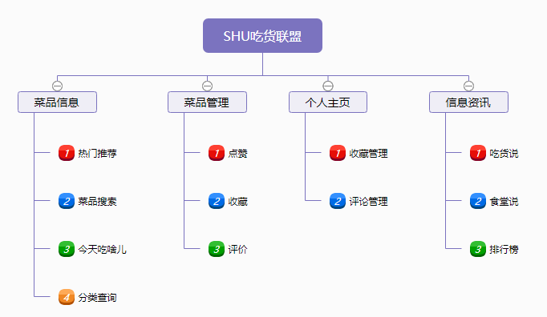
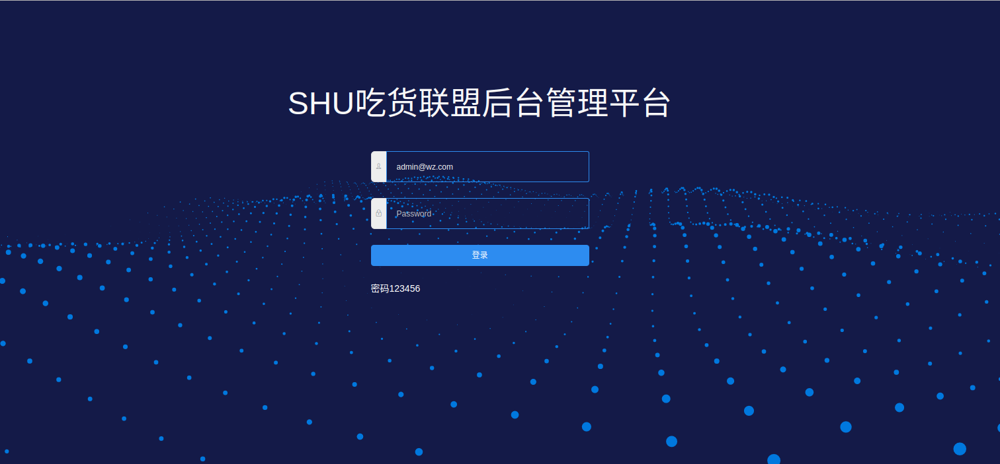
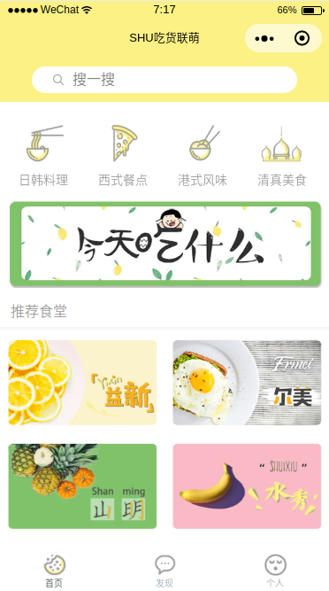
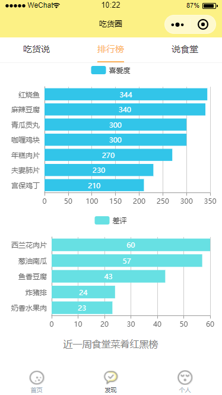

# SHU吃货联萌

#### 项目介绍
微信小程序《SHU吃货联萌》是一个基于上海大学食堂系统的高校大学生饮食生活平台，提供全面的食堂菜品信息，同时具备点评、推荐等功能。
其应用场景如下：
- 学生想通过预先浏览菜品信息来决定去哪个食堂吃什么
- 学生想吃某个菜，但不知道哪个食堂有，也不知道这个菜评价如何
- 学生吃了一道很美味或不合胃口的菜，想要评价
- 学生想了解跟食堂有关的资讯

#### 使用技术
HTML、CSS、JS前端技术栈以及wxml等小程序组件和API  
Eslint  
组件化开发  
Sass  
ES6  
Asynx+await  
Nodejs网络请求  
Koa2  
Koa-router  
Koa2中间件  
腾讯云wafer2  
Mysql数据库  
Knex.js  
SSL部署  
Nginx反向代理	

#### 使用说明
./client 小程序端

./server 后端 nodejs

扫码

####作品截图

